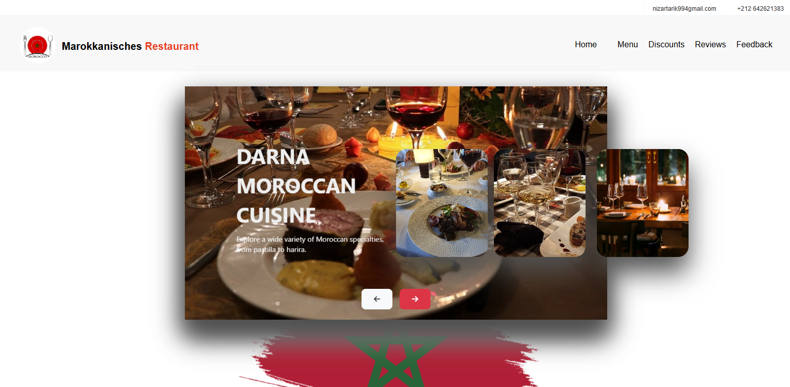
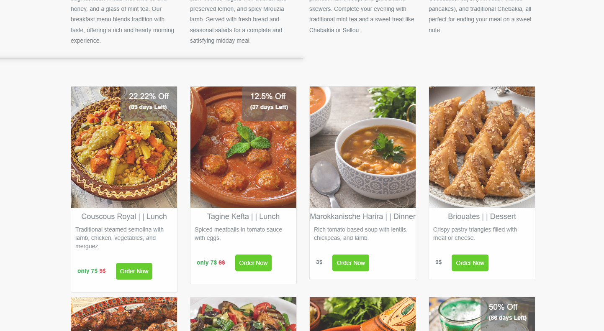
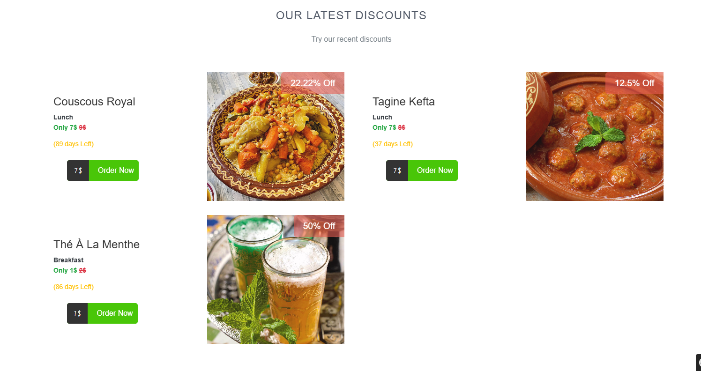
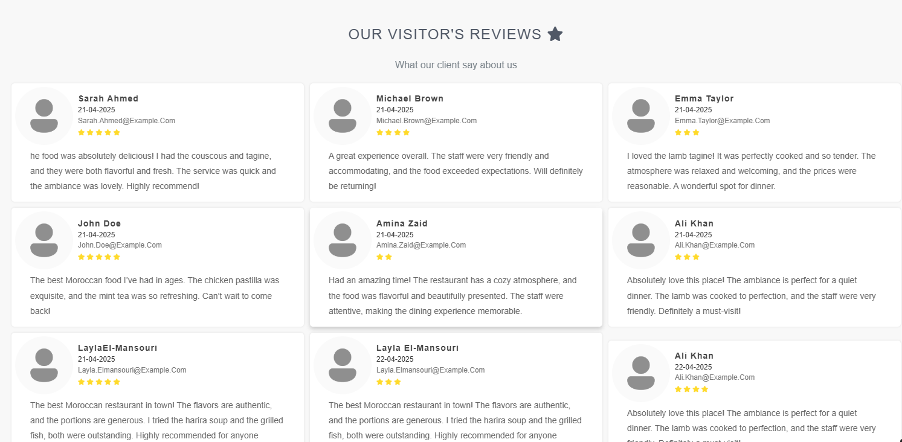
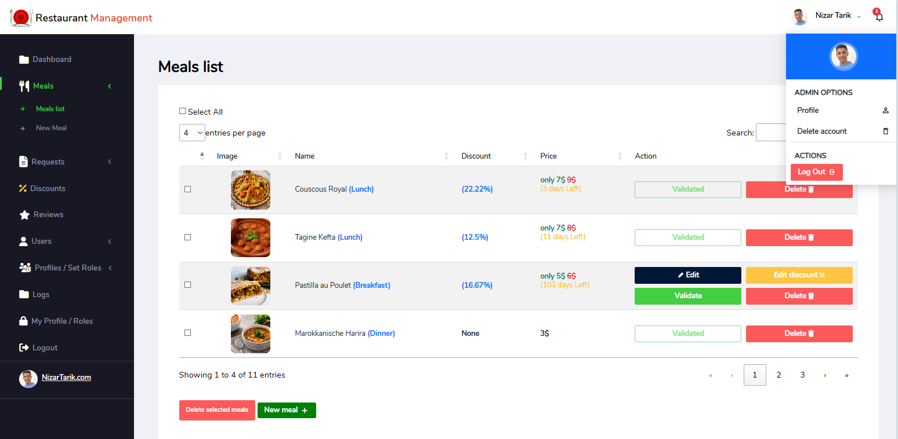

# Moroccan Restaurant Information Website 🇲🇦🍽️

A website showcasing Moroccan cuisine with an admin dashboard for managing dishes, user profiles, and reviews.
## 📑 Table of Contents

- [🌟 Features](#-features)
- [🔑 Login Information (Admin)](#-login-information-admin)
- [👨‍🍳 Public Interface](#-public-interface)
- [🔐 Admin Dashboard](#-admin-dashboard)
- [🛠️ Technologies Used](#️-technologies-used)
- [🧪 Installation](#-installation)
- [📸 Screenshots](#-screenshots)

---
## 🌟 Features
## 🔑 Login Information (Admin)

Admin Dashboard Login is available at the route:  
**`/login`**

> **Default Admin Credentials:**
> - **Email:** nizartarik994@gmail.com  
> - **Password:** Nizar457

### 👨‍🍳 Public Interface
- Home page with introduction to Moroccan cuisine
- Menu display with traditional morocain dishes (tagine, couscous, pastilla, etc.)
- Customer reviews and testimonials
- Contact page 

### 🔐 Admin Dashboard
- Authentication, users, profiles and roles management
- Manage meals: create, edit, delete, and apply discounts
- Manage customer reviews
- View statistics: total meals, users, reviews, and offers

## 🛠️ Technologies Used

- **Frontend**: HTML, CSS, JavaScript, Bootstrap
- **Backend**: PHP, Symfony
- **Database**: MySQL

## 🧪 Installation

-git clone https://github.com/NizarTarik/Marokkanisches-Restaurant.git  
-composer installt  
-php bin/console doctrine:database:createt  
-php bin/console doctrine:migrations:migratet  
-symfony server:startt  

## 📸 Screenshots

  

       
      
      
    
    
  

